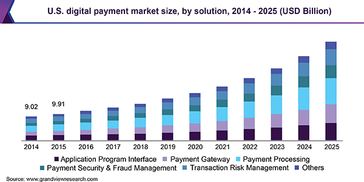
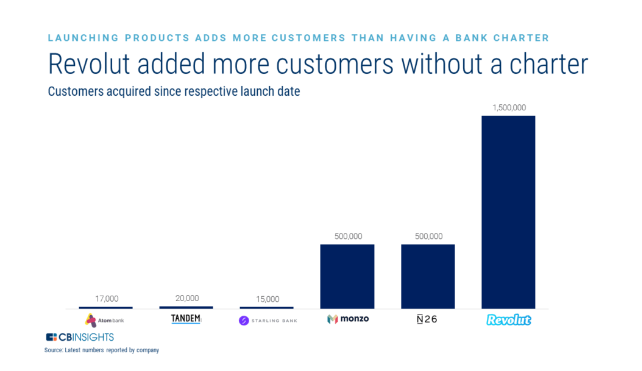
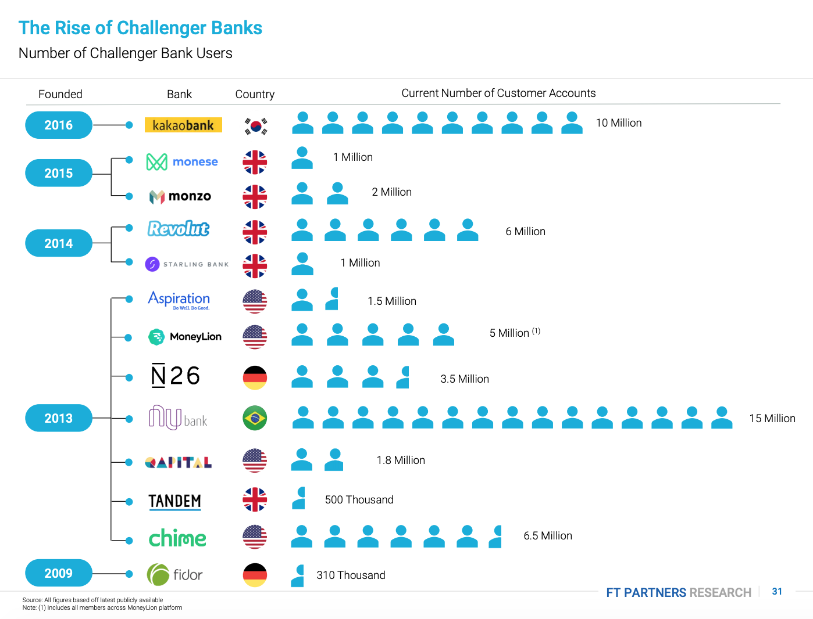

# TESTING-FOR-CASE-STUDY

By: Camillo D'Orazio, September 2020

1

## Overview and Origin

**Revolut** was founded by Nikolay Storonsky and Vlad Yatsenko on July 1, 2015.2 **Revolut**'s main business idea was to have the ability to send money internationally. **Revolut** offers free, fast, and secure money transfers to a bank accounts in over 130 countries, and this is done using the real exchange rate you see quoted and traded without any additional fees or mark-ups.3 **Revolut** has compiled roughly £627 million since their launch in 2015 with investors including *DST Global*, which was an early backer of *Facebook* and *Spotify*. The company has 29 main investors including, most notably, the tennis star Andy Murray.4 

**Revolut** is passively looking to raise an additional USD$500 million to launch a commission free stock trading platform. Storonsky, who is currently acting as CEO, stated in an interview with CNBC, in July 2019, that Japan's tech investment giant, *SoftBank*, could be a "potential partner".5

## Business Activities

**Revolut** was founded based on providing secure money transfers to banks globally using a real exchange rate. In 2018, many institutional investors, as well as individual investors, initiated lawsuits against big banks for *"restrained trade, decreased competition, and artificially increased prices"* in the foreign exchange markets ("FOREX").6 

The FOREX market is, and has always been, a highly decentralized financial market with, at times, high transaction costs. Since there is no centralized market for FOREX, banks can charge consumers any fee they want almost at will! However, because there are many global banks, including central banks, who participate in the FOREX markets, who compete for business from both institutional and individual investors, mark-ups can be quite competitive if you shop around. 

**Revolut**'s original customer target base was the individual consumer and payment processing of FOREX transactions. It is the individual consumer who suffers the most from transaction costs because of the small transaction size and banks' inefficiencies in processing small FOREX transactions. Individual consumers, or retail investors, in the FOREX markets make up the smallest portion of all FOREX volume and mainly use the FOREX market to make payments, speculate and/or day trade.7

The digital banking market, and more specifically the payment processing solution, continues to grow at a steady pace as depicted in the following chart:

8

**Revolut** began with an initial cloud-based solution. The company had a rapid growth spurt since its launch and developed over 50 applications into its platform. However, their initial solution started to become overwhelmed as it wanted to automate as many processes as possible, but deployment became increasing challenging. They began to test a range of solutions to find a platform and environment that could have continuous delivery and be able to release as many applications as possible. The company ultimately decided to use the *Google Cloud Platform* ("GCP"). **Revolut** built its new core infrastructure with *Compute Engine* virtual machines and used *Cloud Identity and Access Management* to secure their environment. They also used *Cloud APIs* along with some other 3rd party tools to fully automate their code deployment and platform management. "Incremental snapshotting is my favorite *Compute Engine* feature," says Vlad Yatsenko. "With the incremental feature, only the initial snapshot is big. The subsequent snapshots are much more efficient in terms of time and storage. Instead of backups lasting up to twenty hours, we now get a snapshot in around five minutes."9

The main solution that **Revolut** is attempting to provide its customer's is a one stop shop for all things in Personal Financial Services. The current market has fragmented FinTech domains and **Revolut**'s goal is to merge all these FinTech domains into one platform.

## Landscape

**Revolut** currently offers *individual* consumers global payment processing, Crypto coin trading and Vaults, Junior accounts (for children ages 12-17), and has extras such as Budgeting & Analytics, Rewards and Donations. The company also offers the following *business* accounts: 
1. Multi-Currency
2. Corporate Credit Cards
3. Money Transfer and Subscription Payment Manager
4. Automated Payroll Processing
5. Corporate Expense Management and Processing

**Revolut** originally was founded in the Payments/Billing domain of FinTech. As the company has experienced tremendous growth it then made a push into other FinTech domains such as: Personal Finance/Deposits/Online Banking and Blockchain and Cryptocurrencies. The company's quest is to become the first truly global banking superapp and it is currently working on platforms for the following FinTech domains: Investment Management, Wealth Management, and InsurTech.10

**Revolut**'s current main competitors include, but not limited to:
1. TransferWire
2. Monzo
3. Starling
4. N26

However, **Revolut** is moving into new FinTech domains that include competitors such as:
1. RobinHood
2. TradeStation
3. TD Ameritrade
4. Betterment
5. And many, many more!!

**Revolut** has been able to obtain more customers since its launch than its main competitors because of the multiple financial service product offering by layering multiple FinTech domains into one application. See below chart.

11

Past trends in FinTech domains that **Revolut** is currently a player in, or aspiring to delve into, have been about financial literacy and cost savings, especially for Millennials, Gen Y, Gen Next and even in the early stages of iGen and Gen Z. You see many FinTech companies already have, or are in the process of, embedding into their platform's tools to help these generations with simple finance tasks such as budgeting, saving for multiple goals (i.e. a car, a house, retirement, etc.), and basics of investing into stocks and bonds as well as diversification within all of these disciplines in personal finance. As FinTech continues to evolve in many of these domains through machine learning processes, and even more so with Artificial Intelligence, including Robo Advising, many of these FinTech domains (i.e. Investment Management, Wealth Management, InsurTech, Mortgage/Real Estate, Personal Finance/Deposits/Online Banking) will continue to build out processes to optimize individuals preferences and quickly provide consumers with recommendations.12

## Results

As noted above with the **Revolut** customer growth chart since their launch, they have successfully invaded the Payments/Billing and Personal Finance/Deposits/Online Banking FinTech domains. In 2007, Dave McClure, venture capitalist, angel investor, and founder of startup accelerator 500 Startups, introduced the world to a 5-step framework for growth for startup companies. That framework was called "*AARRR*" and is also sometimes referred to as Pirate Metrics.13

"*AARRR*" is an acronym that stands for: 
1. ***A**cquisition* - "Where are users/customer's coming from?"
    - A useful KPI can be Cost Per Acquisition (or "CPA's")
2. ***A**ctivation* - "How good is the user's/customer's first experience?"
    - A useful KPI can be Monthly Active Users (or "MAU's")

3. ***R**etention* - "How many customers are you retaining and why are you losing other customer's"
    - Useful KPI's would include:
        - active accounts 
        - inactive accounts 
        - returning customers
4. ***R**eferral* - "How can you turn your customers into your advocates?"
    - A useful KPI would be "social shares" or, as more commonly referred to as "Social Media KPI's"
5. ***R**evenue* - "How can you increase revenue?"
    - Useful KPI's would include:
        - Revenues on daily, weekly, monthly, etc. basis
        - Number of transactions on daily, weekly, monthly, etc. basis
14

Below are some charts that show **Revolut**'s KPI's using some of *AARRR* best practices.

15

16

16

17

In looking at these charts closely, you will notice that **Revolut** has the lowest cost to acquire customers which in turn led them to achieve double digit revenue growth faster than their competitors. We can also see that **Revolut** is the 3rd most searched Neo Bank and has the 2nd largest current and active customer base. Now this is just a small sample of KPI's we are viewing, but one could infer that **Revolut** seems to be doing a lot of the right things as a start-up for continued growth and success. 

## Recommendations

I believe that, **Revolut** is taking a good approach to continued growth with adding a Wealth and Investment Management platform. This seems to be the status quo of a natural progression for any financial services or banking institution. However, when entering new domains, there comes other obstacles and challenges. The main challenge for Revolut will most likely come from Regulatory requirements to operate globally (i.e. licensing, ability to perform cross-border transactions, reporting, etc.). Partnering with *Bearingpoint* RegTech to manage these requirements, is a step into the right direction. Given that **Revolut** is currently operating, and has been since their launch, with a net loss, the company would require additional funding to continue to expand into new domains. The question then becomes, how much of the company are you willing to sacrifice to venture capitalists versus taking a step back, get to profitability and reinvest your own hard-earned capital into future growth. 

In my opinion, **Revolut** should first focus on the InsurTech and Mortgage/Real Estate domains. These domains can be deployed with a fairly low cost and thus, produce higher profit margins. Also, these domains are staples for any individual. You need a home to live in, and most likely a mortgage or even a Real Estate agent to find your perfect home. You need a car to get to work, or go grocery shopping, and therefore may need a car loan but most definitely will need car insurance. Perhaps as an individual, you may have some discretionary income to buy life insurance. Then, and only then, will an individual start taking any excess and discretionary funds and start investing. 

InsurTech and Mortgage/Real Estate domains typically use data analysis tools and API technology. However, for example, some InsurTech start-ups are delving into Artificial Intelligence to handle what brokers would do to find the right mix of policies tailored to a customer's needs. 18

In conclusion, **Revolut** is certainly an interesting case and a FinTech company to watch going forward. The hope for Revolut is that they stay on a steady course for growth and not try to take on too many domains and expand into too many countries just to be the #1 global player in FinTech. Expanding too fast without profitability at some point can, and, as many other companies have proven in history, will be disastrous. As the adage goes, slow and steady wins the race!

____________________________________________________________________________________________________________________
1 Revolut Logo from Revolut website - https://blog.revolut.com/were-getting-a-fresh-new-look-at-revolut/

2 Wikipedia https://en.wikipedia.org/wiki/Revolut

3 Morahan, G. (2019, December 10) *Considering getting **Revolut** Here's what you need to know* Extra.ie https://extra.ie/2019/10/12/business/irish/revolut-heres-need-to-know

4 Barton, C. (2020, September 2) *Revolut statistics* Finder https://www.finder.com/uk/revolut-statistics

5 Brown,Ryan (2019, July 5) *Inside **Revolut**'s bid to be the Amazon of banking, and the lessons it's learned from breakneck growth* CNBC https://www.cnbc.com/2019/07/05/revolut-ceo-nikolay-storonsky-on-the-fintech-unicorns-journey.html

6 Török, L. (2018, November 9) *Lawsuit Levied against Banks over Rigged Foreign Exchange Rates* Veem https://medium.com/small-business-big-world/lawsuit-levied-against-banks-over-rigged-foreign-exchange-rates-5f8e3d459428#:~:text=Institutional%20investors%20filed%20a%20lawsuit,foreign%20exchange%20(forex)%20prices.&text=This%20kind%20of%20opting%20out,they%20sue%20on%20their%20own.

7 Segal, Troy (2019, October 24) *Forex Market: Who Trades Currency and Why* Investopedia https://www.investopedia.com/articles/forex/11/who-trades-forex-and-why.asp 

8 Grand View Research (2019, November) *Digital Payment Market Size, Share & Trends Analysis Report By Solution, By Mode of Payment, By Deployment, By Enterprise Size, By End Use, By Region, And Segment Forecasts, 2019 - 2025* Grand View Research https://www.grandviewresearch.com/industry-analysis/digital-payment-solutions-market

9 Google Cloud *Revolut: Simplifying cross-currency payments with Google Cloud Platform* Google Cloud https://cloud.google.com/customers/revolut

10 **Revolut** website https://www.revolut.com/en-US

11 SDK.finance *How to Build a Revolut-like Digital Bank?* SDK.Finance https://sdk.finance/how-to-build-a-revolut-like-digital-bank/#revolut-overview

12 BuiltIn staff (2019, November 8 updated 2020, May 27) *THESE ARE THE FINTECH TRENDS TO WATCH, ACCORDING TO 13 EXPERTS* BuiltIn https://builtin.com/fintech/fintech-trends

13 Blake, Melanie (2017, November 25) *AARRR Framework- Metrics That Let Your StartUp Sound Like A Pirate Ship* Medium https://medium.com/@ms.mbalke/aarrr-framework-metrics-that-let-your-startup-sound-like-a-pirate-ship-e91d4082994b#:~:text=10%20years%20ago%2C%20Dave%20McClure,or%20also%20the%20Pirate%20Metrics.

14 Levi, Amit (2019, June 12) *Fintech Analytics: The Top 7 Metrics Every Fintech Company Should Monitor* Benzinga https://www.benzinga.com/fintech/19/06/13911172/fintech-analytics-the-top-7-metrics-every-fintech-company-should-monitor

15 Graham, Cameron (2019, June 14) *The costs of acquiring customers for cross-border companies and neobanks* FXCintelligence https://www.fxcintel.com/research/analysis/the-costs-of-acquiring-customers-for-cross-border-companies-and-neobanks

16 Fintechnews Switzerland (2020, January 18) *New Report Sheds Light on Booming Challenger Bank Market* Fintechnews Switzerland https://fintechnews.ch/virtual-banking/new-report-sheds-light-on-booming-challenger-bank-market/32682/

17 LHBS (2019, July 23) *Neobanks: Postponing Profit To Grow Customer Base* LHBS https://www.lhbs.com/brand-strategy/neobanks-postponing-profit-to-grow-customer-base/

18 Hargrave, Marshall (2020, August 27) *Insurtech* Investopedia https://www.investopedia.com/terms/i/insurtech.asp

